```python
import csv
import datetime
import pandas as pd
import matplotlib.pyplot as plt
import seaborn as sns


def parse_time(text):
    return datetime.datetime.strptime(text, '%Y-%m-%d %H:%M:%S.%f')


def load_csv(filename):
    with open(filename, encoding='utf8') as f:
        return list(csv.reader(f, delimiter=','))


# id, task, variant, group, time

mesages = pd.read_csv('messages.csv',header = None, names = ["id", 'task', 'variant', 'group', 'time'])

# id, message_id, time, status
checks = pd.read_csv('checks.csv',header = None, names = ["id", 'message_id', 'time', 'status'])

# task, variant, group, time, status, achievements
statuses = pd.read_csv('statuses.csv' , header=None, names = ['task', 'variant', 'group', 'time', 'status', 
                                                              'achievements'])
```


```python
mesages["time"] = mesages["time"].astype("datetime64[ns]")
checks['time'] = checks['time'].astype("datetime64[ns]")
statuses['time'] = statuses['time'].astype("datetime64[ns]")

```

# 3.1 Как по дням недели распределяется активность студентов?


```python
plt.figure(figsize = (10,10))
days = [datetime.datetime.weekday(mesages["time"].iloc[i]) for i in range(len(mesages))]
for i, day in enumerate(days):
    if day==0:
        days[i] = "Понедельник"
    elif day == 1:
        days[i] = "Вторник"
    elif day == 2:
        days[i] = "Среда"
    elif day == 3:
        days[i] = "Четверг"
    elif day == 4:
        days[i] = "Пятница"
    elif day == 5:
        days[i] = "Суббота"
    elif day == 6:
        days[i] = "Воскресенье"
sns.countplot(days, order = ["Понедельник","Вторник","Среда","Четверг","Пятница","Суббота","Воскресенье"])

```

    /Users/egormatolygin/opt/anaconda3/lib/python3.9/site-packages/seaborn/_decorators.py:36: FutureWarning: Pass the following variable as a keyword arg: x. From version 0.12, the only valid positional argument will be `data`, and passing other arguments without an explicit keyword will result in an error or misinterpretation.
      warnings.warn(


    <AxesSubplot:ylabel='count'>


    
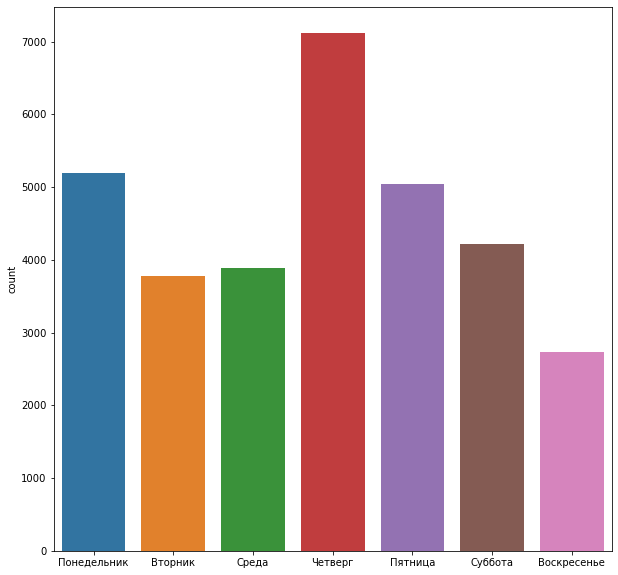
    


# 3.2 Как по времени суток распределяется активность студентов?


```python
plt.figure(figsize = (10,10))
hours = [datetime.datetime.timetuple(mesages["time"].iloc[i])[3] for i in range(len(mesages))]
sns.countplot(hours)
```

    /Users/egormatolygin/opt/anaconda3/lib/python3.9/site-packages/seaborn/_decorators.py:36: FutureWarning: Pass the following variable as a keyword arg: x. From version 0.12, the only valid positional argument will be `data`, and passing other arguments without an explicit keyword will result in an error or misinterpretation.
      warnings.warn(


    <AxesSubplot:ylabel='count'>


    
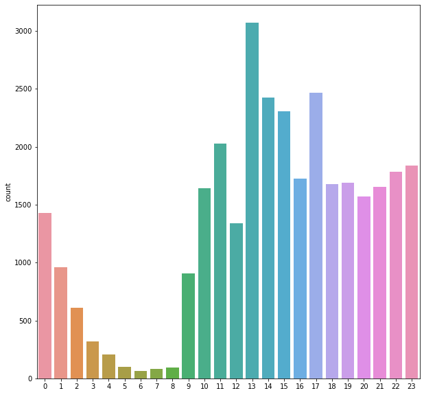
    


# 3.3 Сколько сообщений в среднем студенты отправляют по каждой задаче?


```python
plt.figure(figsize = (10,10))
group = mesages.groupby(["task",'variant','group']).count()
avgtime = group.groupby("task")["id"].mean()
plt.bar(x = avgtime.index,height = avgtime, color=(0.2, 0.4, 0.6, 0.6))
```


    <BarContainer object of 8 artists>


    
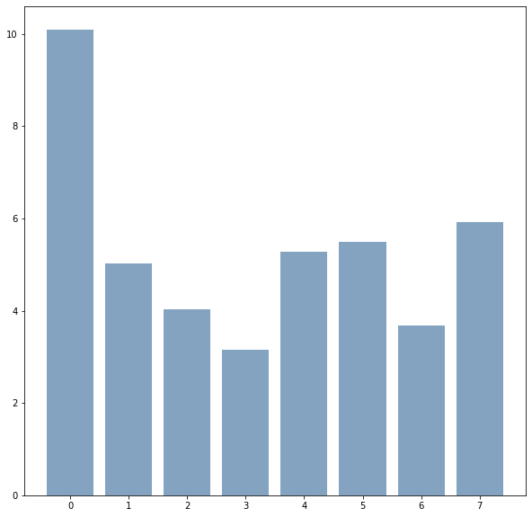
    


# 3.4 Как за период с начала семестра менялась активность студентов по каждой из задач?


```python
days = mesages.copy()
days["time"] = days["time"].dt.date

act = days.groupby(["task","time"]).count()
#act = pd.DataFrame(act)
act["task"] = [day[0] for day in act.index]
act["time"] = [day[1] for day in act.index]
act
```


<div>
<style scoped>
    .dataframe tbody tr th:only-of-type {
        vertical-align: middle;
    }

    .dataframe tbody tr th {
        vertical-align: top;
    }

    .dataframe thead th {
        text-align: right;
    }
</style>
<table border="1" class="dataframe">
  <thead>
    <tr style="text-align: right;">
      <th></th>
      <th></th>
      <th>id</th>
      <th>variant</th>
      <th>group</th>
      <th>task</th>
      <th>time</th>
    </tr>
    <tr>
      <th>task</th>
      <th>time</th>
      <th></th>
      <th></th>
      <th></th>
      <th></th>
      <th></th>
    </tr>
  </thead>
  <tbody>
    <tr>
      <th rowspan="5" valign="top">0</th>
      <th>2023-02-08</th>
      <td>2</td>
      <td>2</td>
      <td>2</td>
      <td>0</td>
      <td>2023-02-08</td>
    </tr>
    <tr>
      <th>2023-02-09</th>
      <td>748</td>
      <td>748</td>
      <td>748</td>
      <td>0</td>
      <td>2023-02-09</td>
    </tr>
    <tr>
      <th>2023-02-10</th>
      <td>926</td>
      <td>926</td>
      <td>926</td>
      <td>0</td>
      <td>2023-02-10</td>
    </tr>
    <tr>
      <th>2023-02-11</th>
      <td>831</td>
      <td>831</td>
      <td>831</td>
      <td>0</td>
      <td>2023-02-11</td>
    </tr>
    <tr>
      <th>2023-02-12</th>
      <td>596</td>
      <td>596</td>
      <td>596</td>
      <td>0</td>
      <td>2023-02-12</td>
    </tr>
    <tr>
      <th>...</th>
      <th>...</th>
      <td>...</td>
      <td>...</td>
      <td>...</td>
      <td>...</td>
      <td>...</td>
    </tr>
    <tr>
      <th rowspan="5" valign="top">7</th>
      <th>2023-03-07</th>
      <td>138</td>
      <td>138</td>
      <td>138</td>
      <td>7</td>
      <td>2023-03-07</td>
    </tr>
    <tr>
      <th>2023-03-08</th>
      <td>216</td>
      <td>216</td>
      <td>216</td>
      <td>7</td>
      <td>2023-03-08</td>
    </tr>
    <tr>
      <th>2023-03-09</th>
      <td>396</td>
      <td>396</td>
      <td>396</td>
      <td>7</td>
      <td>2023-03-09</td>
    </tr>
    <tr>
      <th>2023-03-10</th>
      <td>141</td>
      <td>141</td>
      <td>141</td>
      <td>7</td>
      <td>2023-03-10</td>
    </tr>
    <tr>
      <th>2023-03-11</th>
      <td>9</td>
      <td>9</td>
      <td>9</td>
      <td>7</td>
      <td>2023-03-11</td>
    </tr>
  </tbody>
</table>
<p>160 rows × 5 columns</p>
</div>


```python
plt.figure(figsize=(15,5))
fig, ax = plt.subplots(figsize = (15,7))
ax.plot(act[act["task"]==0]["time"], act[act["task"]==0]["id"],c = "tab:blue")
ax.plot(act[act["task"]==1]["time"], act[act["task"]==1]["id"],c = 'tab:orange')
ax.plot(act[act["task"]==2]["time"], act[act["task"]==2]["id"],c = 'tab:green')
ax.plot(act[act["task"]==3]["time"], act[act["task"]==3]["id"],c = 'tab:red')
ax.plot(act[act["task"]==4]["time"], act[act["task"]==4]["id"],c = 'tab:purple')
ax.plot(act[act["task"]==5]["time"], act[act["task"]==5]["id"],c = 'tab:brown')
ax.plot(act[act["task"]==6]["time"], act[act["task"]==6]["id"],c = 'tab:pink' )
ax.plot(act[act["task"]==7]["time"], act[act["task"]==7]["id"],c = 'tab:cyan')

ax.legend(["Задание 1","Задание 2","Задание 3","Задание 4","Задание 5","Задание 6","Задание 7","Задание 8"])
```


    <matplotlib.legend.Legend at 0x7ff3f2bcb6d0>


    <Figure size 1080x360 with 0 Axes>


    
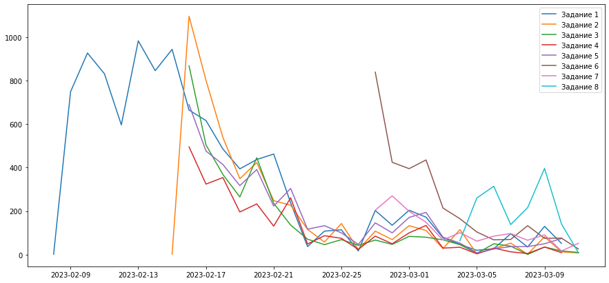
    


# 3.5 В каких группах было отправлено больше всего сообщений?


```python
from matplotlib.patches import Patch

color = []
fig,ax = plt.subplots(figsize= (25,10))
group = mesages.groupby("group").count()
for cl in group.index:
    if cl[:4]=="ИВБО":
        color.append("tab:purple")
    elif cl[:4]=="ИКБО":
        color.append("tab:orange")
    elif cl[:4]=="ИМБО":
        color.append("tab:pink")
    else:
        color.append("tab:blue")
ax.bar([ind[1]+ind[5:7] for ind in group.index],group["id"],color = color)
legend_elements = [Patch(facecolor='tab:purple',label='ИВБО'),Patch(facecolor='tab:orange',label='ИКБО'),
                  Patch(facecolor='tab:pink',label='ИМБО'),Patch(facecolor='tab:blue',label='ИНБО')]
ax.legend(handles=legend_elements)
```


    <matplotlib.legend.Legend at 0x7ff3f25daeb0>


    
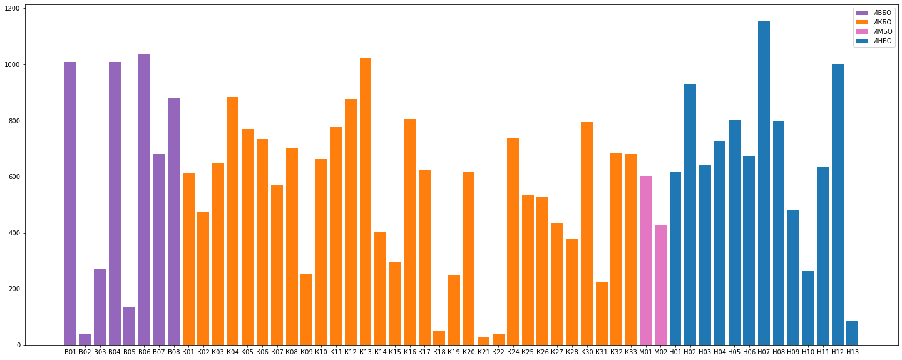
    


# 3.6 В каких группах было получено больше всего правильных решений?


```python
color = []
fig,ax = plt.subplots(figsize= (25,10))
df = checks.merge(mesages.rename(columns = {"id":"message_id"})[["group","message_id"]], how = 'left', on = "message_id")
group = df[df['status']==2].groupby("group").count()
group
for cl in group.index:
    if cl[:4]=="ИВБО":
        color.append("tab:purple")
    elif cl[:4]=="ИКБО":
        color.append("tab:orange")
    elif cl[:4]=="ИМБО":
        color.append("tab:pink")
    else:
        color.append("tab:blue")

ax.bar([ind[1]+ind[5:7] for ind in group.index],group["id"],color = color)
legend_elements = [Patch(facecolor='tab:purple',label='ИВБО'),Patch(facecolor='tab:orange',label='ИКБО'),
                  Patch(facecolor='tab:pink',label='ИМБО'),Patch(facecolor='tab:blue',label='ИНБО')]
ax.legend(handles=legend_elements)
```


    <matplotlib.legend.Legend at 0x7ff3eae5db50>


    
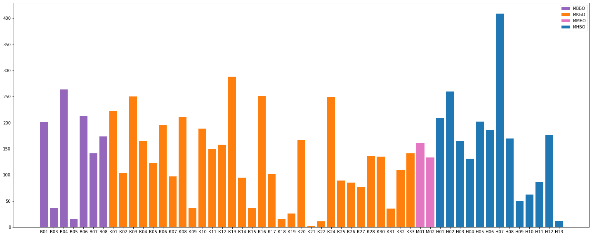
    


# 3.7 Какие задачи оказались самыми легкими, самыми сложными?


```python
df = checks.merge(mesages.rename(columns = {"id":"message_id"})[["task","message_id"]], how = 'left', on = "message_id")
group = df.groupby(["task",'status']).count()
group = group[["id"]]
group["task"]=  [ind[0] for ind in group.index]
group["status"]=  [ind[1] for ind in group.index]
```


```python
group["diff"]=0
for task in group["task"].unique():
    correct = group[group["task"]==task].iloc[0,0]
    _all = group[group["task"]==task].iloc[0,0] + group[group["task"]==task].iloc[1,0] +\
              group[group["task"]==task].iloc[2,0]
    group.iloc[[task*3,task*3+1,task*3+2],3] = correct/_all
group
```


<div>
<style scoped>
    .dataframe tbody tr th:only-of-type {
        vertical-align: middle;
    }

    .dataframe tbody tr th {
        vertical-align: top;
    }

    .dataframe thead th {
        text-align: right;
    }
</style>
<table border="1" class="dataframe">
  <thead>
    <tr style="text-align: right;">
      <th></th>
      <th></th>
      <th>id</th>
      <th>task</th>
      <th>status</th>
      <th>diff</th>
    </tr>
    <tr>
      <th>task</th>
      <th>status</th>
      <th></th>
      <th></th>
      <th></th>
      <th></th>
    </tr>
  </thead>
  <tbody>
    <tr>
      <th rowspan="3" valign="top">0</th>
      <th>2</th>
      <td>1556</td>
      <td>0</td>
      <td>2</td>
      <td>0.146199</td>
    </tr>
    <tr>
      <th>3</th>
      <td>8224</td>
      <td>0</td>
      <td>3</td>
      <td>0.146199</td>
    </tr>
    <tr>
      <th>6</th>
      <td>863</td>
      <td>0</td>
      <td>6</td>
      <td>0.146199</td>
    </tr>
    <tr>
      <th rowspan="3" valign="top">1</th>
      <th>2</th>
      <td>1294</td>
      <td>1</td>
      <td>2</td>
      <td>0.270938</td>
    </tr>
    <tr>
      <th>3</th>
      <td>3255</td>
      <td>1</td>
      <td>3</td>
      <td>0.270938</td>
    </tr>
    <tr>
      <th>6</th>
      <td>227</td>
      <td>1</td>
      <td>6</td>
      <td>0.270938</td>
    </tr>
    <tr>
      <th rowspan="3" valign="top">2</th>
      <th>2</th>
      <td>957</td>
      <td>2</td>
      <td>2</td>
      <td>0.265833</td>
    </tr>
    <tr>
      <th>3</th>
      <td>2555</td>
      <td>2</td>
      <td>3</td>
      <td>0.265833</td>
    </tr>
    <tr>
      <th>6</th>
      <td>88</td>
      <td>2</td>
      <td>6</td>
      <td>0.265833</td>
    </tr>
    <tr>
      <th rowspan="3" valign="top">3</th>
      <th>2</th>
      <td>1286</td>
      <td>3</td>
      <td>2</td>
      <td>0.466280</td>
    </tr>
    <tr>
      <th>3</th>
      <td>1185</td>
      <td>3</td>
      <td>3</td>
      <td>0.466280</td>
    </tr>
    <tr>
      <th>6</th>
      <td>287</td>
      <td>3</td>
      <td>6</td>
      <td>0.466280</td>
    </tr>
    <tr>
      <th rowspan="3" valign="top">4</th>
      <th>2</th>
      <td>1072</td>
      <td>4</td>
      <td>2</td>
      <td>0.256031</td>
    </tr>
    <tr>
      <th>3</th>
      <td>2798</td>
      <td>4</td>
      <td>3</td>
      <td>0.256031</td>
    </tr>
    <tr>
      <th>6</th>
      <td>317</td>
      <td>4</td>
      <td>6</td>
      <td>0.256031</td>
    </tr>
    <tr>
      <th rowspan="3" valign="top">5</th>
      <th>2</th>
      <td>593</td>
      <td>5</td>
      <td>2</td>
      <td>0.196163</td>
    </tr>
    <tr>
      <th>3</th>
      <td>2278</td>
      <td>5</td>
      <td>3</td>
      <td>0.196163</td>
    </tr>
    <tr>
      <th>6</th>
      <td>152</td>
      <td>5</td>
      <td>6</td>
      <td>0.196163</td>
    </tr>
    <tr>
      <th rowspan="3" valign="top">6</th>
      <th>2</th>
      <td>410</td>
      <td>6</td>
      <td>2</td>
      <td>0.280822</td>
    </tr>
    <tr>
      <th>3</th>
      <td>993</td>
      <td>6</td>
      <td>3</td>
      <td>0.280822</td>
    </tr>
    <tr>
      <th>6</th>
      <td>57</td>
      <td>6</td>
      <td>6</td>
      <td>0.280822</td>
    </tr>
    <tr>
      <th rowspan="3" valign="top">7</th>
      <th>2</th>
      <td>240</td>
      <td>7</td>
      <td>2</td>
      <td>0.156047</td>
    </tr>
    <tr>
      <th>3</th>
      <td>1283</td>
      <td>7</td>
      <td>3</td>
      <td>0.156047</td>
    </tr>
    <tr>
      <th>6</th>
      <td>15</td>
      <td>7</td>
      <td>6</td>
      <td>0.156047</td>
    </tr>
  </tbody>
</table>
</div>


```python
plt.figure(figsize = (10,10))
plt.bar(group["task"],group["diff"],color = "tab:orange")
```


    <BarContainer object of 24 artists>


    
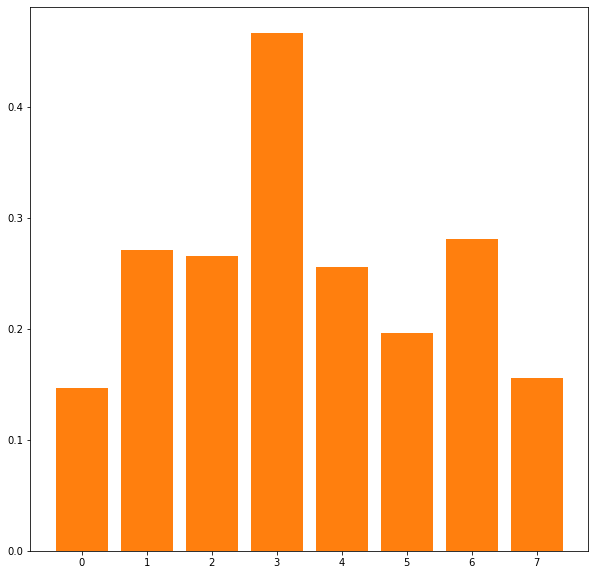
    


# 3.8 Студенты каких групп заработали больше всего достижений?


```python
import numpy as np

color = []
fig,ax = plt.subplots(figsize= (25,10))


df = statuses.copy()
for i in range(len(df["task"])):
    df["achievements"].iloc[i] = len(list(filter(None,df["achievements"].iloc[i]
                                                 [1:len(df["achievements"].iloc[i])-1].split(", "))))
group = df.groupby("group").sum()

for cl in group.index:
    if cl[:4]=="ИВБО":
        color.append("tab:purple")
    elif cl[:4]=="ИКБО":
        color.append("tab:orange")
    elif cl[:4]=="ИМБО":
        color.append("tab:pink")
    else:
        color.append("tab:blue")

ax.bar([ind[1]+ind[5:7] for ind in group.index],group["task"],color = color)
legend_elements = [Patch(facecolor='tab:purple',label='ИВБО'),Patch(facecolor='tab:orange',label='ИКБО'),
                  Patch(facecolor='tab:pink',label='ИМБО'),Patch(facecolor='tab:blue',label='ИНБО')]
ax.legend(handles=legend_elements)
```

    /Users/egormatolygin/opt/anaconda3/lib/python3.9/site-packages/pandas/core/indexing.py:1732: SettingWithCopyWarning: 
    A value is trying to be set on a copy of a slice from a DataFrame
    
    See the caveats in the documentation: https://pandas.pydata.org/pandas-docs/stable/user_guide/indexing.html#returning-a-view-versus-a-copy
      self._setitem_single_block(indexer, value, name)


    <matplotlib.legend.Legend at 0x7ff3b0023ac0>


    
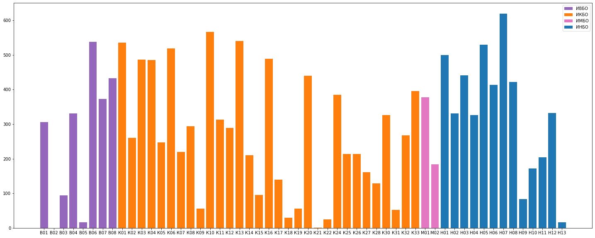
    


# 3.9 Кто находится на первых 10 местах в рейтинге студентов?


```python
df = checks.merge(mesages.rename(columns = {"id":"message_id"})[["group","message_id","variant"]],
                  how = 'left', on = "message_id")
df = df[df["status"]==2].groupby(["group","variant"]).count().nlargest(10,"id")
df["group"] = [group[0] for group in df.index]
df["variant"] = [group[1] for group in df.index]
df.index = range(1,11)
df = df[["group","variant","id"]].rename(columns = {"id":"Количество правильных решений"})
df
```


<div>
<style scoped>
    .dataframe tbody tr th:only-of-type {
        vertical-align: middle;
    }

    .dataframe tbody tr th {
        vertical-align: top;
    }

    .dataframe thead th {
        text-align: right;
    }
</style>
<table border="1" class="dataframe">
  <thead>
    <tr style="text-align: right;">
      <th></th>
      <th>group</th>
      <th>variant</th>
      <th>Количество правильных решений</th>
    </tr>
  </thead>
  <tbody>
    <tr>
      <th>1</th>
      <td>ИКБО-08-21</td>
      <td>5</td>
      <td>90</td>
    </tr>
    <tr>
      <th>2</th>
      <td>ИКБО-03-21</td>
      <td>3</td>
      <td>79</td>
    </tr>
    <tr>
      <th>3</th>
      <td>ИНБО-12-21</td>
      <td>12</td>
      <td>61</td>
    </tr>
    <tr>
      <th>4</th>
      <td>ИКБО-28-21</td>
      <td>17</td>
      <td>58</td>
    </tr>
    <tr>
      <th>5</th>
      <td>ИМБО-02-21</td>
      <td>13</td>
      <td>56</td>
    </tr>
    <tr>
      <th>6</th>
      <td>ИНБО-07-21</td>
      <td>3</td>
      <td>56</td>
    </tr>
    <tr>
      <th>7</th>
      <td>ИВБО-04-21</td>
      <td>21</td>
      <td>50</td>
    </tr>
    <tr>
      <th>8</th>
      <td>ИНБО-02-21</td>
      <td>21</td>
      <td>48</td>
    </tr>
    <tr>
      <th>9</th>
      <td>ИНБО-07-21</td>
      <td>4</td>
      <td>46</td>
    </tr>
    <tr>
      <th>10</th>
      <td>ИНБО-07-21</td>
      <td>11</td>
      <td>46</td>
    </tr>
  </tbody>
</table>
</div>


# 3.10 В каких группах студенты чаще решают задачи различными способами?


```python
color = []
fig,ax = plt.subplots(figsize= (25,10))

df = checks.merge(mesages.rename(columns = {"id":"message_id"})[["group","message_id","variant"]],
                  how = 'left', on = "message_id")
df = df[df["status"]==2].groupby(["group","variant"]).count()
df = df.groupby("group").mean()

for cl in group.index:
    if cl[:4]=="ИВБО":
        color.append("tab:purple")
    elif cl[:4]=="ИКБО":
        color.append("tab:orange")
    elif cl[:4]=="ИМБО":
        color.append("tab:pink")
    else:
        color.append("tab:blue")

ax.bar([ind[1]+ind[5:7] for ind in df.index],df["id"],color = color)
legend_elements = [Patch(facecolor='tab:purple',label='ИВБО'),Patch(facecolor='tab:orange',label='ИКБО'),
                  Patch(facecolor='tab:pink',label='ИМБО'),Patch(facecolor='tab:blue',label='ИНБО')]
ax.legend(handles=legend_elements)

font1 = {'size':25}
ax.set_title("Среднее количество правильных решений учеников",fontdict=font1)

```


    Text(0.5, 1.0, 'Среднее количество правильных решений учеников')


    
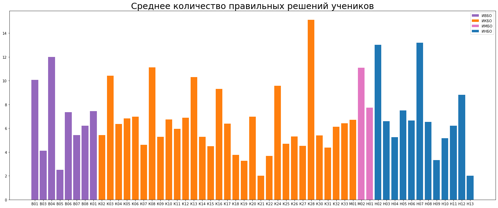
    


# 3.11 Какие годы были самыми популярными с точки зрения выхода игр?


```python
games = pd.read_csv("GAMES.csv",sep=";",header = None, names = ["Автор", 'Жанр', 'Файл', 'Год'])
```


```python
plt.figure(figsize=(20,10))
sns.countplot(games[games["Год"]!="не издана"]["Год"])
```

    /Users/egormatolygin/opt/anaconda3/lib/python3.9/site-packages/seaborn/_decorators.py:36: FutureWarning: Pass the following variable as a keyword arg: x. From version 0.12, the only valid positional argument will be `data`, and passing other arguments without an explicit keyword will result in an error or misinterpretation.
      warnings.warn(


    <AxesSubplot:xlabel='Год', ylabel='count'>


    
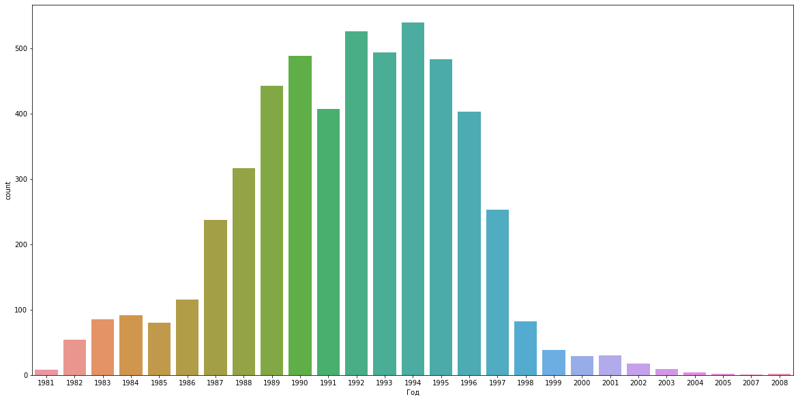
    


# 3.12 Какие жанры были популярны в различные периоды времени?


```python
games["Жанр"].unique()
```


    array(['Arcade', 'Action', 'Simulation', 'Sports', 'Strategy', 'RPG',
           'Adventure', 'Tabletop', 'Racing', 'Educational',
           'Interactive Fiction', 'Quest', 'Puzzle', 'Other', 'Fighting'],
          dtype=object)


```python
#fig, ax = plt.subplots(figsize = (15,7))
sns.color_palette("tab20")
sns.set_color_codes("bright")
plt.figure(figsize=(20,10))
group = games[games["Год"]!= 'не издана'].groupby(["Год","Жанр"]).count()
group["Жанр"] = [ind[1] for ind in group.index]
group["Год"] = [ind[0] for ind in group.index]

#group.index = group["Год"]
#ax.plot(group[group["Жанр"]=="Action"]["Автор"])
#ax.plot(group[group["Жанр"]=="Arcade"]["Автор"])

sns.lineplot(data = group,x="Год",y = "Автор",hue = "Жанр")

#ax.legend(group["Жанр"].unique()[1:4])
```


    <AxesSubplot:xlabel='Год', ylabel='Автор'>


    
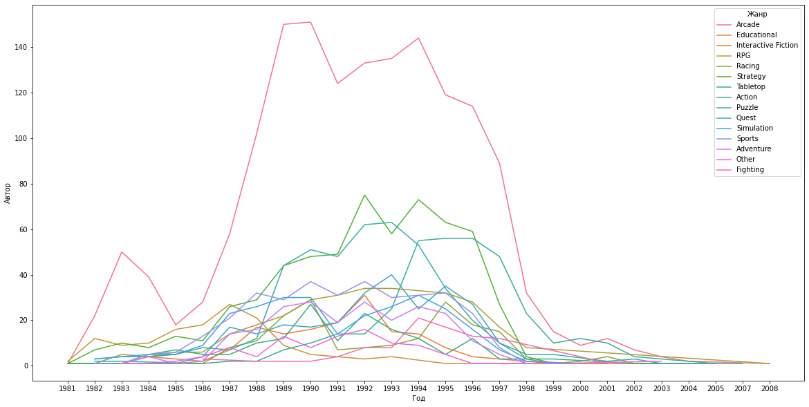
    


```python

```
